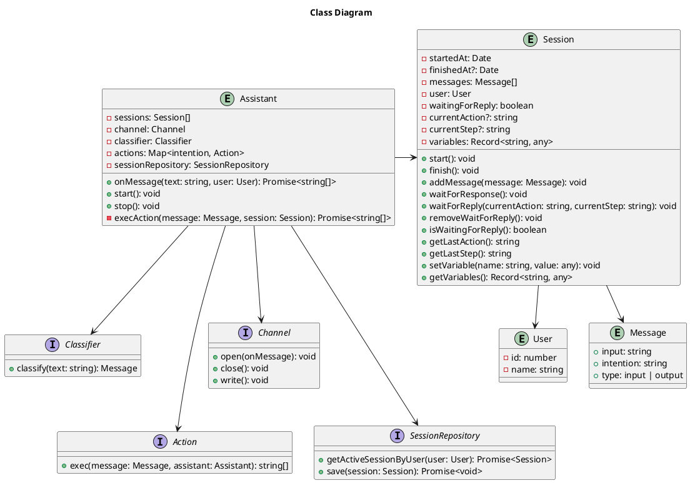

# Class diagram

The class diagram illustrates the relationships and responsibilities of each class in the chatbot system. It serves as a visual representation of the system's structure and can guide the implementation of the chatbot's functionality.

Feel free to customize and expand upon this class diagram to fit your specific project requirements.

---

## Description

- **Assistant:** Represents the main class responsible for managing the chatbot. It maintains sessions, uses a classifier to classify messages, executes actions based on intentions, and interacts with a session repository for session management.

- **Classifier (interface):** Defines the contract for a classifier that can classify messages based on their text.

- **Action (interface):** Defines the contract for an action that can be executed based on a message and the assistant. Actions perform specific tasks or provide responses based on the message's intention.

- **Session:** Represents a session in which messages are exchanged between the chatbot and a user. It tracks the start and finish time, holds the messages exchanged, manages the user's interaction within the session, and stores session variables.

- **User:** Represents a user interacting with the chatbot. It contains user-related information such as the user ID and name.

- **Message:** Represents a message exchanged within a session. It contains the input text, the classified intention, and the type of message (input or output).

- **Channel (interface):** Defines the contract for a communication channel through which the chatbot interacts with users. It provides methods to open, close, and write messages.

- **SessionRepository (interface):** Defines the contract for a repository that manages chatbot sessions. It provides methods to retrieve an active session by user and save a session.
